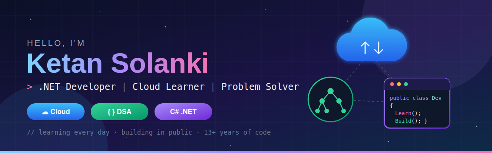

<!-- 🔁 Replace YOUR_USERNAME and YOUR_LINKEDIN everywhere before publishing -->

---

## 👋 About Me

I'm a **.NET developer with 13+ years of experience in C#**, including years building **healthcare software (EHR scheduling, billing and medical records modules)**. I'm now moving into **cloud engineering**, sharpening my **data structures & algorithms**, and building in public.

- 🔭 **Currently building:** cloud-ready .NET projects
- 🌱 **Currently learning:** Cloud (Azure / AWS) · DSA · modern .NET
- 🧩 **Practising:** a DSA problem every day, documented in [dsa-practice](https://github.com/YOUR_USERNAME/dsa-practice)
- 💬 **Ask me about:** C#, ASP.NET, SQL, healthcare systems
- 🤝 **Open to:** cloud / .NET roles and open-source collaboration

---

## 🛠️ Tech Stack

**Languages**

**Frameworks & Tools**

**Cloud & DevOps** *(learning)*

---

## 📌 Featured Projects

| Project | What it does | Tech |
|:--|:--|:--|
| 🧩 [**dsa-practice**](https://github.com/YOUR_USERNAME/dsa-practice) | DSA solutions organized by pattern, each with approach, dry run and complexity | C++ · C# |
| ☁️ [**project-name**](https://github.com/YOUR_USERNAME/project-name) | *e.g. ASP.NET Core API deployed to Azure with CI/CD* | .NET · Azure · Docker |
| 🏥 [**project-name**](https://github.com/YOUR_USERNAME/project-name) | *e.g. appointment booking API inspired by my EHR experience* | C# · SQL |

---

## 🧠 DSA Progress

| Pattern | Solved | Status |
|:--|:-:|:--|
| Two Pointers | 1 | 🟢 In progress |
| Sliding Window | 0 | ⚪ Up next |
| Hash Map | 0 | ⚪ Up next |
| Stack | 0 | ⚪ Up next |
| Dynamic Programming | 0 | ⚪ Up next |

---

## 📊 GitHub Stats

---

*“Learning every day, building in public.”*

